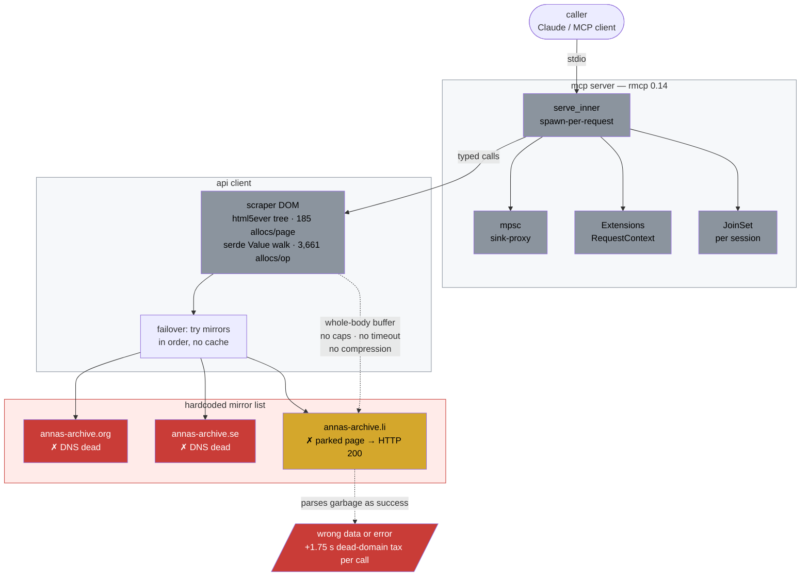
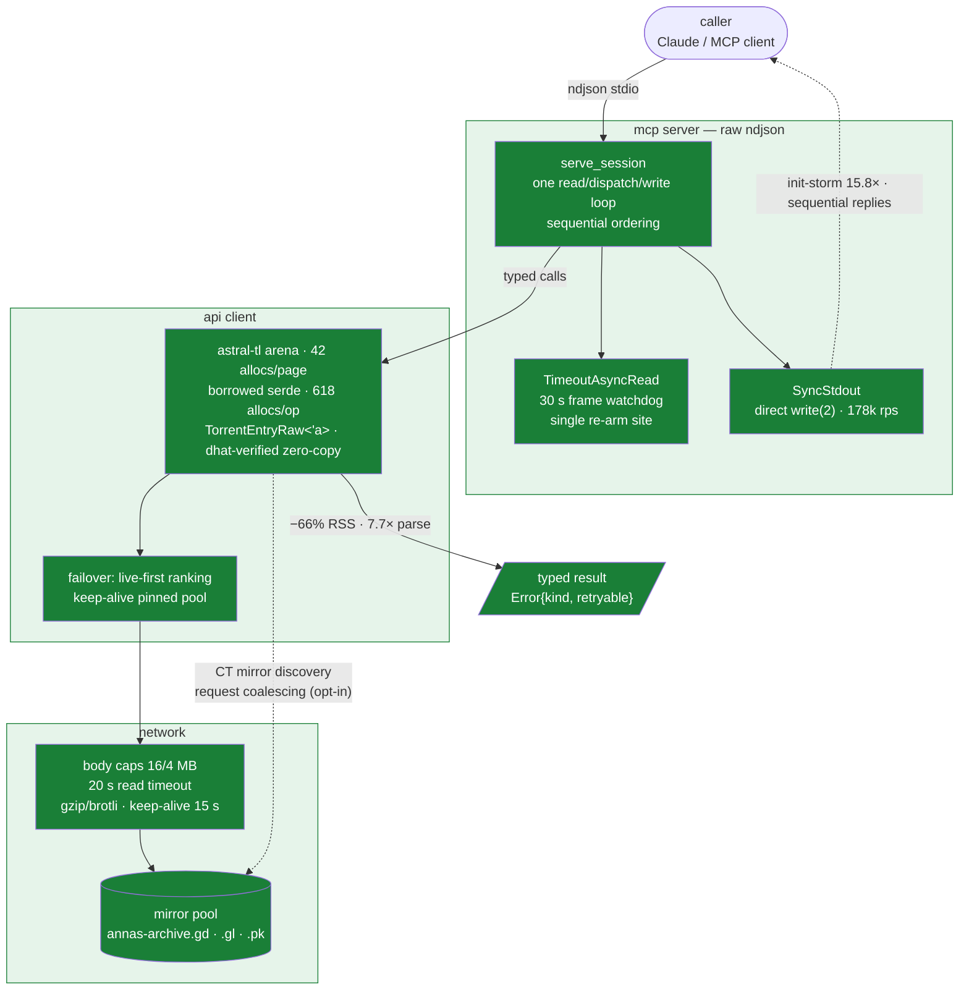

# Anna's Archive MCP

MCP server for [Anna's Archive](https://annas-archive.gd): search books, papers, journals; get metadata; mint fast-download URLs. Rust, zero-copy parsing.

Fork of [RemiKalbe/annas-archive-mcp](https://github.com/RemiKalbe/annas-archive-mcp), rewritten:

- [`annas-archive-api`](annas-archive-api/README.md) — library crate (parsing, HTTP, mirrors)
- [`annas-archive-mcp`](annas-archive-mcp/README.md) — server crate (same 5 tools, wire-compatible)

| Metric | Upstream | Here | Δ |
|---|---:|---:|---:|
| Search parse | 28,169 ops/s | 218,125 ops/s | 7.7× |
| Record parse | 2,613 ops/s | 9,499 ops/s | 3.6× |
| Torrents parse | 43 ops/s | 560 ops/s | 13× |
| URL build | 6.81M ops/s | 63.90M ops/s | 9.4× |
| MCP init storm | ~10k rps | 158k rps | 15.8× |
| Peak RSS | 23.4 MB | 7.9 MB | −66% |
| Binary | 15.0 MB | 9.0 MB | −38% |
| Live latency | +1.75 s dead-mirror tax | 0 | −1.75 s/call |
| Wire bytes | uncompressed | gzip+brotli | 7.8–11.7× less |

Byte-equal outputs, 146 tests, 615-input fuzz clean.

## Architecture — before (upstream)



## Architecture — after (this fork)



## Install

```bash
cargo install annas-archive-mcp
```

Claude Desktop:

```json
{
  "mcpServers": {
    "annas-archive": {
      "command": "annas-archive-mcp",
      "env": { "ANNAS_ARCHIVE_API_KEY": "your-secret-key" }
    }
  }
}
```

Key = account secret key; members get fast downloads, others search/metadata only.

## Tools

`search` (no key) · `get_details` (key, `profile` arg) · `get_download_url` (key) · `prewarm` (no key) · `get_membership_status` (key)

## Env flags (off by default)

`AA_LENIENT_RECORDS` · `AA_REQUEST_COALESCING` · `AA_DYNAMIC_MIRRORS` · `MCP_STDIO_READ_TIMEOUT_MS` (default 30000)

## License

MIT
