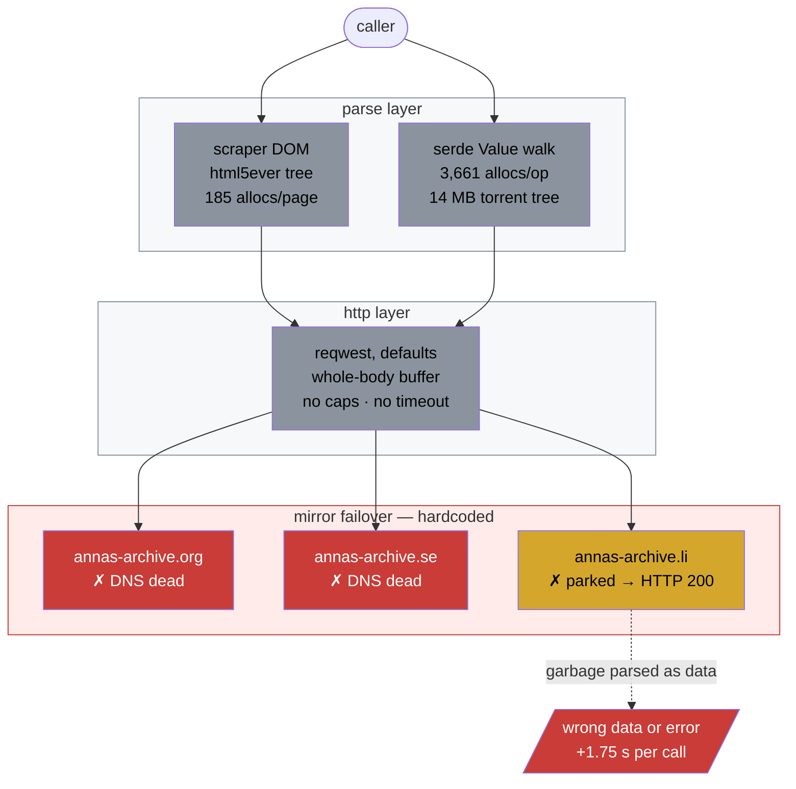
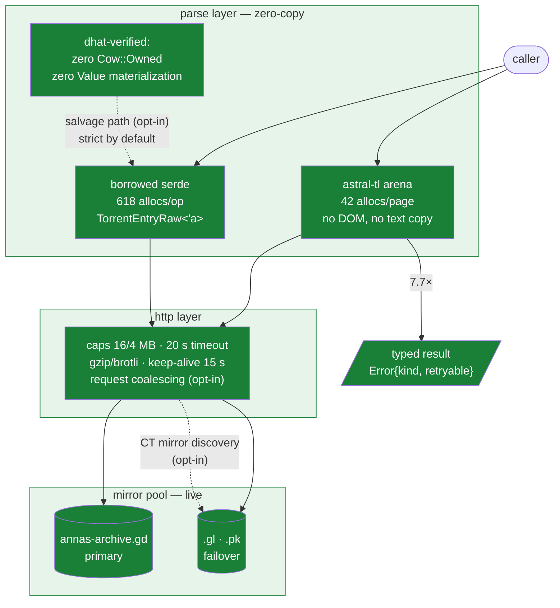

# annas-archive-api

Rust client library for [Anna's Archive](https://annas-archive.gd): search, metadata, fast-download URLs. Zero-copy parsing, 6 deps.

Rewritten from [RemiKalbe/annas-archive-mcp](https://github.com/RemiKalbe/annas-archive-mcp)'s library crate. Consumed by [`annas-archive-mcp`](../annas-archive-mcp/README.md); overview in [root README](../README.md).

| Metric | Upstream | Here | Δ |
|---|---:|---:|---:|
| Search parse | 28,169 ops/s | 218,125 ops/s | 7.7× |
| Record parse | 2,613 ops/s | 9,499 ops/s | 3.6× |
| Torrents parse | 43 ops/s | 560 ops/s | 13× |
| URL build | 6.81M ops/s | 63.90M ops/s | 9.4× |
| Peak RSS | 23.4 MB | 7.9 MB | −66% |
| Live latency | +1.75 s dead-mirror tax | 0 | −1.75 s/call |

Byte-equal outputs, fuzz clean (615 inputs).

## Architecture — before (upstream)



## Architecture — after (this crate)



## Usage

```rust
let client = AnnasArchiveClient::new(key);
let results = client.search("rust", 1).await?;        // SearchResults
let details = client.get_details("md5").await?;       // ItemDetails
let url = client.fast_download_url("md5").await?;     // member URL
```

## Surface

`AnnasArchiveClient` (`with_page`, `with_lenient_records`, `with_request_coalescing`) · parsers `parse_search_results`, `parse_json_details[_mode]`, `parse_torrents` · types `SearchResults`, `ItemDetails`, `DownloadInfo` · errors `Parse{...}`, `Api`, `Http`, `Network`, `MissingApiKey`, `AllDomainsFailed` (+ `is_retryable`)

LOC 781 → 1,843: buys borrowed parsing, salvage, keep-alive engine, profiles.

## License

MIT
