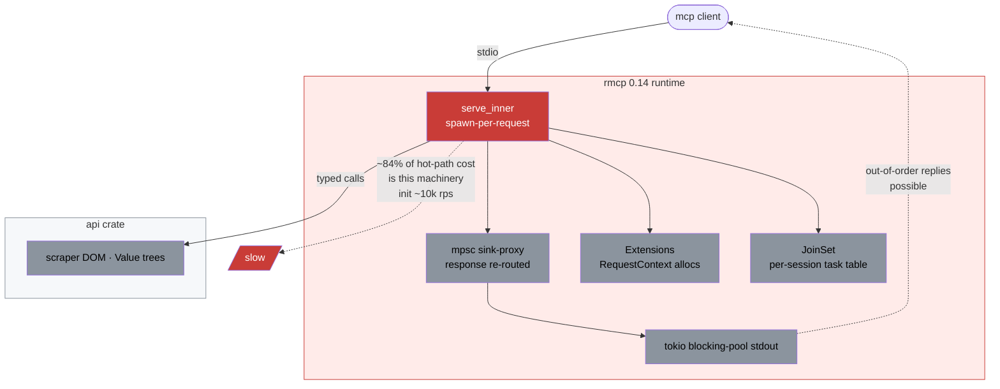
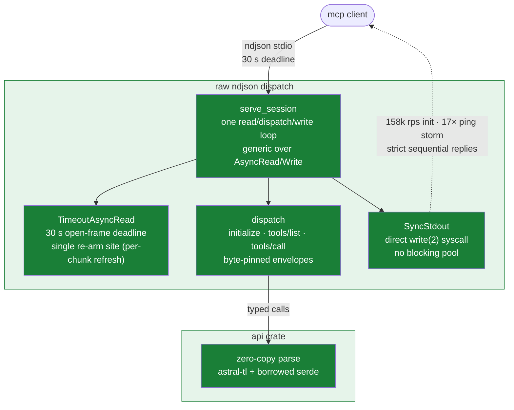

# annas-archive-mcp

MCP server for [Anna's Archive](https://annas-archive.gd) over stdio: search, metadata, fast-download URLs. One binary, 4 deps, raw ndjson dispatch.

Rewritten from [RemiKalbe/annas-archive-mcp](https://github.com/RemiKalbe/annas-archive-mcp)'s server crate. Same 5 tools, wire-byte-compatible. Wraps [`annas-archive-api`](../annas-archive-api/README.md); overview in [root README](../README.md).

| Metric | Upstream | Here | Δ |
|---|---:|---:|---:|
| MCP init storm | ~10k rps | 158k rps | 15.8× |
| Stdout ping storm | 10.5k rps | 178k rps | 17× |
| tools/list p50 | 0.133 ms | 0.081 ms | 1.6× |
| rmcp framework | in tree | removed | −48 lockfile packages |
| Binary | 15.0 MB | 9.0 MB | −38% |

146 tests, byte-identical stdout vs golden transcripts, 1000-frame adversarial probe clean.

## Architecture — before (upstream, rmcp 0.14)



## Architecture — after (this crate)



## Tools

`search` (no key) · `get_details` (key, `profile` arg) · `get_download_url` (key) · `prewarm` (no key) · `get_membership_status` (key)

## Install

```bash
cargo install annas-archive-mcp
```

Claude Desktop:

```json
{
  "mcpServers": {
    "annas-archive": {
      "command": "annas-archive-mcp",
      "env": { "ANNAS_ARCHIVE_API_KEY": "your-secret-key" }
    }
  }
}
```

## Notes

Fixed `V_2024-11-05` echo; tools/list pinned byte-exact by test. Sequential replies; batching skipped (matches upstream). HTTP transport: NO-GO, measured +3.0 MB for no consumer.

LOC 214 → 671: the dispatch loop, watchdog, envelopes — price of rmcp removal at byte-parity.

## License

MIT
